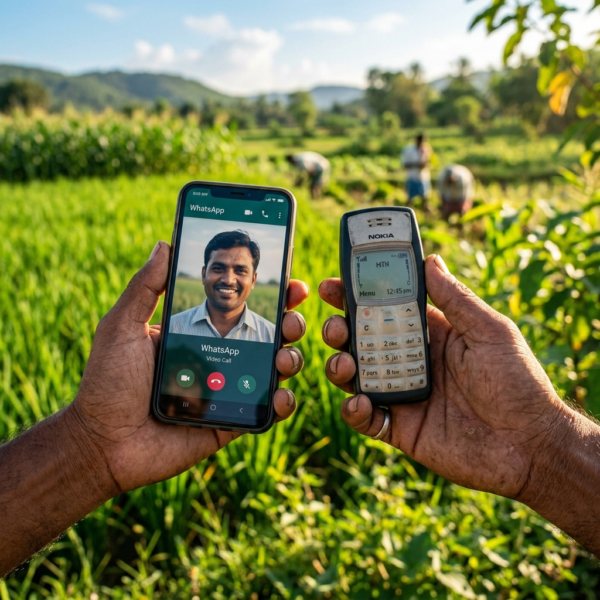

# VaaniSetu — Solution Overview

## What Is VaaniSetu?

**VaaniSetu** (meaning "voice bridge" in Sanskrit) is a fully offline AI-powered translation platform built specifically for BAIF Development Research Foundation. It translates agricultural training videos, audio recordings, and text documents into 22 official Indian languages — covering over 1.3 billion speakers — without requiring an internet connection after the one-time setup.

The platform runs on a standard office computer (Windows 11, i5 or Ryzen 5 processor, 16 GB RAM) and serves the entire office network from a single machine, making it accessible from any device connected to the office WiFi.

---

## Why Was It Built?

BAIF's field officers distribute training content in English and a few regional languages, but many farming communities across Maharashtra, Bihar, Assam, Odisha, and other states speak primarily their local dialect. The gap between content creation and community reach costs real impact. Professional translation is expensive (₹850+ per minute), slow (weeks per project), and unavailable off-hours in rural areas with poor connectivity.

VaaniSetu eliminates this barrier by bringing AI translation directly into the BAIF office — offline, instant, and free to operate after setup.

---

## Who Uses It?

| Role | How They Use VaaniSetu |
|------|------------------------|
| **Training Officers** | Upload training videos and get translations in multiple languages within minutes |
| **Field Coordinators** | Use Reverse Bridge mode to upload farmer audio and get English summaries for HQ |
| **Content Reviewers** | Approve or edit amber-confidence translations before distribution |
| **IT Admin** | Manage server startup, backups, model updates |
| **Programme Managers** | View Impact Ledger to report social impact to funders |

---

## Seven Innovations

| # | Innovation | What It Does |
|---|-----------|--------------|
| 1 | **Job Pipeline** | Automatically processes uploaded files through 7 stages: validate → extract audio → transcribe → translate → generate outputs → package ZIP |
| 2 | **Translation Memory** | Remembers past translations so the same sentence is never translated twice — gets faster and more accurate over time |
| 3 | **Confidence Gate** | AI assigns a confidence score to every translated sentence. Green = ready to distribute, Amber = review first, Red = manual retranslation needed |
| 4 | **Reverse Bridge** | Field officers can upload farmer audio in any regional language; VaaniSetu transcribes and translates it to English for HQ experts |
| 5 | **Impact Ledger** | Automatically tracks hours translated, money saved vs. professional translation, and number of farmers reached — with PDF export for donor reports |
| 6 | **IVR / Feature Phone Export** | Auto-generates 8kHz mono audio for direct telecom broadcast to basic phones |
| 7 | **WhatsApp Auto-Splitter** | Slices translated videos into <15MB chunks to bypass WhatsApp limits |

---

## Production-Ready Edge Case Handling
Hackathon projects often break in the real world. VaaniSetu was built to survive BAIF's actual IT constraints:
- **RAM Spike Protection:** Uploads are chunk-streamed to disk in 64KB blocks, preventing memory crashes even if a 2GB video is uploaded to a cheap 16GB laptop.
- **Smart Target Deduplication:** The cache intelligently checks not just the file hash, but the exact target languages requested, ensuring partial cache hits don't cause missing translations.
- **AI Hallucination Guards:** Whisper STT silence/noise (empty strings) is intercepted and sanitized before hitting IndicTrans2, preventing tensor crashes and hallucinated text loops.
- **Auto-Disk Recovery:** Intermediate gigabyte-heavy workspace files are automatically purged after every successful run, preventing the NGO server from running out of disk space over time.
- **Force Re-run (Bypass Cache):** If a user corrects a translation in the Review Queue, they can re-run the job with "Force Re-run" checked. This bypasses the deduplication check, applies the updated Translation Memory corrections, and generates a fresh ZIP with corrected captions and audio in under 1 minute.

---

## Key Metrics (Design Targets)

| Metric | Target |
|--------|--------|
| Languages supported | 22 official Indian languages |
| Formats accepted | Video (.mp4, .mkv), Audio (.mp3, .wav), Documents (.txt, .pdf, .docx, .csv) |
| Output formats per job | .txt, bilingual .docx, .srt, .vtt, TTS .mp3, captioned .mp4, .zip |
| Internet required at runtime | **None** |
| Maximum file size | 2 GB |
| Concurrent jobs | 1 (FIFO queue, preserves RAM) |
| LAN accessibility | All devices on office WiFi |
| Data storage | Local SQLite — never leaves the building |
