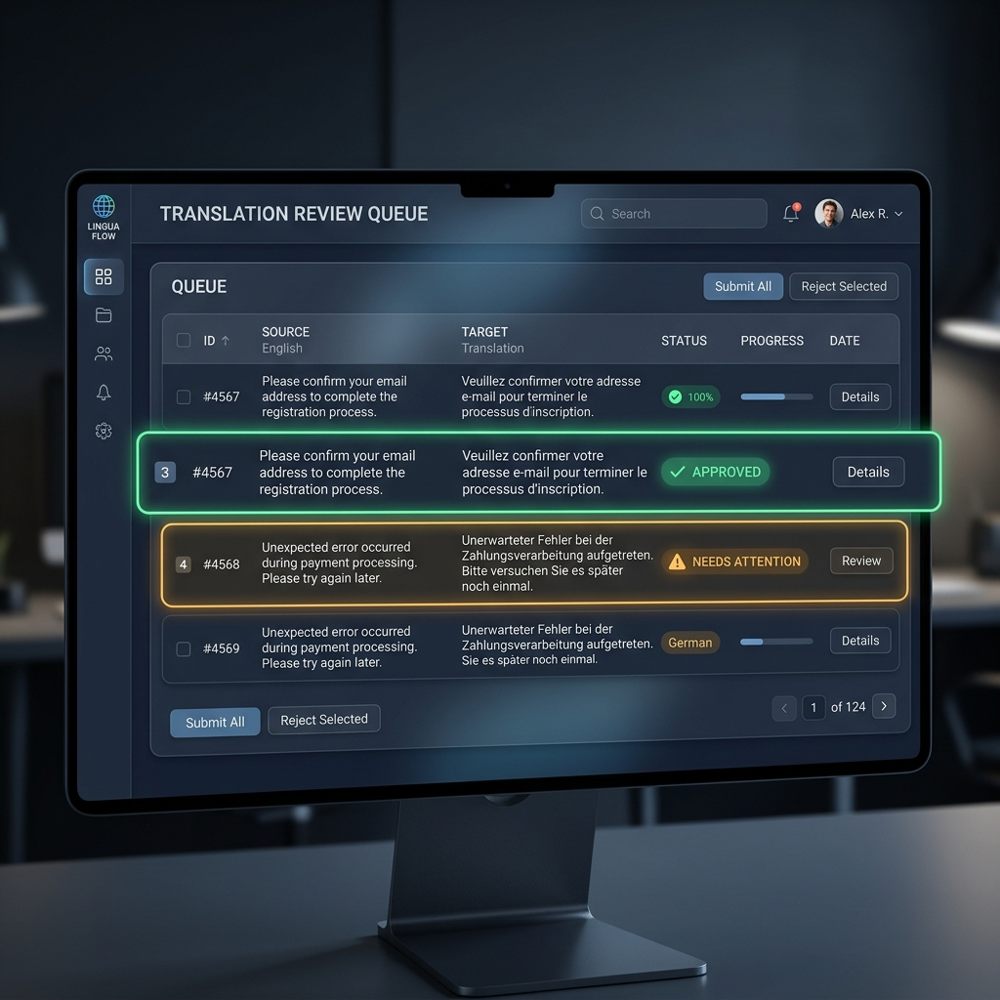

# VaaniSetu — Architecture & Data Flow

## System Architecture (4 Layers)

```
┌─────────────────────────────────────────────────────┐
│  LAYER 4: USER INTERFACE (React 18 + Vite)          │
│  In-Browser Result Studio · Live Audio Player       │
│  WhatsApp & IVR Feature Phone Simulators            │
│  1-Click Demo Presets · Direct Mic Voice Recorder   │
│  5 Pages: Upload · History · Review · Impact · Glossary │
│  Polls /api/health every 30s · SSE for live progress│
└────────────────────┬────────────────────────────────┘
                     │ HTTP / SSE on port 8765
┌────────────────────▼────────────────────────────────┐
│  API LAYER (FastAPI + JWT Authentication)           │
│  REST endpoints + Live MP3 Audio Streaming          │
│  In-Browser Preview Endpoint (/api/jobs/{id}/preview)│
│  Demo Scenarios (/api/jobs/scenarios)               │
│  Role-Based Access Control (Admin vs User)          │
└────────────────────┬────────────────────────────────┘
                     │ Python function calls / Thread Pools
┌────────────────────▼────────────────────────────────┐
│  LAYER 2: PIPELINE ENGINE                           │
│  RAM-Aware Job Queue · Concurrency Planner          │
│  Model Replica Pools · Shared Locks (Whisper/TTS/IT2)│
│  Pipelined Processor (Translate ↔ Generate Overlap) │
│  FFmpeg · faster-Whisper (INT8 CTranslate2 + VAD)   │
│  IndicTrans2 · AgriShield™ Domain Dictionary (120+) │
│  Librosa Pitch Analysis → Piper TTS / Coqui XTTS    │
│  Translation Memory · Confidence Scorer             │
└────────────────────┬────────────────────────────────┘
                     │ SQLite WAL (30s timeout) · File I/O
┌────────────────────▼────────────────────────────────┐
│  LAYER 1: DATA LAYER                                │
│  SQLite WAL (4 tables) · C:\VaaniSetu\              │
│  workspace/{job_id}/ · outputs/{job_id}.zip         │
│  models/ (faster-Whisper, IndicTrans2, XTTS, Piper) │
└─────────────────────────────────────────────────────┘
```

---

## The 7-Stage Pipelined Engine

Located in `backend/pipeline/processor.py`. Jobs are scheduled dynamically by the **RAM-Aware Concurrency Planner** (`backend/utils/resources.py`), allocating job workers and generation threads based on free memory and physical CPU cores.

#### Stage 0: Upload & Deduplication (Edge Case Optimized)
- File is received via `multipart/form-data`.
- **Edge Case Protection:** It is *chunk-streamed* to disk (64KB at a time), ensuring RAM doesn't spike when a 2GB video is uploaded.
- **Smart Deduplication:** The SHA-256 hash of the file is checked against the database. If it matches a completed job and the requested languages are already present, the cached ZIP is returned instantly.
- **Force Re-run (Bypass Cache):** Bypasses cache check and re-runs the pipeline pulling recent Translation Memory corrections in under 1 minute.

```
User uploads file
       │
       ▼
[1] VALIDATING ──── Check file type, size, SHA-256 dedup
       │
       ▼
[2] EXTRACTING ──── FFmpeg: audio normalization → 16 kHz mono WAV
       │            (OR DocumentParser: PDF / DOCX / CSV / TXT)
       ▼
[3] TRANSCRIBING ── faster-Whisper INT8 + Silero VAD (with TRANSCRIBE_LOCK) → text segments
       │            with timestamps + language detection code
       ▼
[4 & 5] PIPELINED TRANSLATION & GENERATION (Overlapped)
       │            Languages translate concurrently; English pivot cached once for all Indic→Indic targets
       │
       ├─► Language 1 Translation (IndicTrans2 / TM / Pivot)
       │     └─► [ThreadPool] Language 1 Generation (TTS, Dubbed MP4,
       │                      Captioned MP4, SRT, DOCX, IVR, WhatsApp)
       │
       ├─► Language 2 Translation (while Lang 1 generates!)
       │     └─► [ThreadPool] Language 2 Generation
       │
       └─► Language N Translation ...
       │
       ▼
[6] PACKAGING ────── manifest.json + all language outputs → .zip
       │            - Outputs bundled into `C:\VaaniSetu\outputs\{job_id}.zip`
       │            - **Auto-Disk Recovery:** Raw uploads and intermediate
       │              `workspace/` files are wiped automatically.
       ▼
COMPLETE — distribution_clearance = cleared | pending_review
```

---

## Input / Output Matrix

| Input Format | Audio Extraction | Transcription | Translation | Outputs |
|---|---|---|---|---|
| `.mp4`, `.mkv` (video) | ✅ FFmpeg | ✅ Whisper | ✅ IndicTrans2 | TXT, DOCX, SRT, VTT, MP3, captioned MP4, ZIP |
| `.mp3`, `.wav` (audio) | ✅ FFmpeg (normalize) | ✅ Whisper | ✅ IndicTrans2 | TXT, DOCX, SRT, VTT, MP3, ZIP |
| `.pdf`, `.docx`, `.csv`, `.txt` | ❌ N/A | ❌ (direct read) | ✅ IndicTrans2 | TXT, DOCX, CSV, ZIP |

---

## Draft vs Full Quality Mode

| Output | ⚡ Draft Mode | 🎬 Full Quality Mode |
|--------|-------------|--------------------|
| Text (.txt) | ✅ | ✅ |
| Subtitles (.srt, .vtt) | ✅ | ✅ |
| TTS Audio (.mp3) | ✅ Piper (fast) | ✅ XTTS (high quality) |
| Bilingual DOCX | ✅ | ✅ |
| Dubbed MP4 | ❌ skipped | ✅ |
| Captioned MP4 | ❌ skipped | ✅ |
| IVR .wav | ❌ skipped | ✅ |
| WhatsApp chunks | ❌ skipped | ✅ |
| Translation beams | 2 (fast) | 4 (accurate) |
| Typical speed (15-min video) | ~3-5 min | ~15-25 min |

---

## Confidence Flow



```
IndicTrans2 generates token scores
         │
         ▼
 mean(log_softmax(scores))
         │
         ▼
 exp( max( mean, -5.0 ) ) = confidence in [0, 1]
         │
    ┌────┴──────┬──────────┐
    │           │          │
  ≥ 0.85      0.65–0.84   < 0.65
    │           │          │
  GREEN       AMBER       RED
  ready    →  Review    manual
  to dist     Queue    retranslate
```

---

## Port & Network

| Service | Port | Protocol | Notes |
|---------|------|----------|-------|
| FastAPI | 8765 | HTTP | LAN-accessible, no auth |
| React Dev | 5173 | HTTP | Development only |
| SQLite | local file | — | Never exposed on network |
